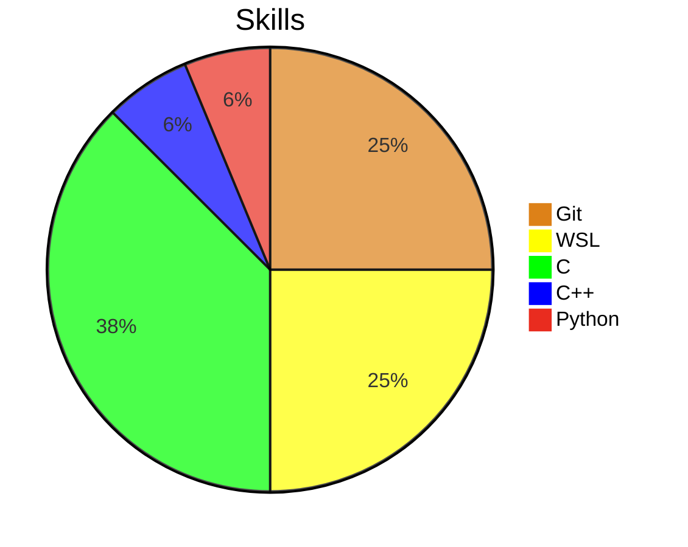

<h1> WELCOME TO MY PROFILE </h1>👋

<!--
**Vasili6/Vasili6** is a ✨ _special_ ✨ repository because its `README.md` (this file) appears on your GitHub profile.

Here are some ideas to get you started:

- 🔭 I’m currently working on ...
- 🌱 I’m currently learning ...
- 👯 I’m looking to collaborate on ...
- 🤔 I’m looking for help with ...
- 💬 Ask me about ...
- 📫 How to reach me: ...
- 😄 Pronouns: ...
- ⚡ Fun fact: ...
-->

**HI THERE**

1. Name: Vasili Chuikov
2. Age: Unknown 
3. Country: Mexico
4. Nickname: Farcode

### :zap: Actividad reciente
<!--START_SECTION:ACTIVITY-->

<!--END_SECTION:ACTIVITY-->

